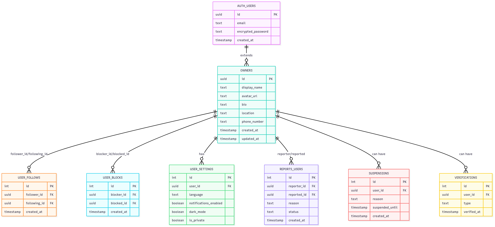

# Petsgram

Comparte la vida de tu mascota con el mundo 🐾  
Una mini red social pensada para dueños y amantes de los animales, donde podrás publicar los momentos más divertidos e inolvidables de tu compañero peludo, seguir a otras mascotas y descubrir su día a día.

---

API construida con [NestJS](https://nestjs.com/) para una mini red social de mascotas, donde los dueños pueden compartir momentos inolvidables de sus animales, seguir a otras mascotas y ver su día a día, usando **PostgreSQL** para datos estructurados y **MongoDB** para almacenamiento de contenidos multimedia y registros no estructurados como posts, likes y comentarios.

## 🚀 Tecnologías

- **NestJS** (framework backend)  
- **PostgreSQL** (datos relacionales)  
- **MongoDB** (datos no estructurados)  
- **Swagger / OpenAPI** (documentación)  
- **TypeScript** (tipado y escalabilidad)

---

## 💾 Bases de datos

### Colecciones de datos (MongoDB)

#### 📁 Colección: `Pets`

| Atributo    | Tipo       | Descripción                                          |
|-------------|------------|------------------------------------------------------|
| _id         | ObjectId   | ID único de la mascota                               |
| ownerId     | string     | ID del usuario dueño (desde Supabase)               |
| name        | string     | Nombre de la mascota                                 |
| type        | string     | Tipo de mascota (dog, cat, rabbit, etc.)            |
| breed       | string     | Raza de la mascota                                   |
| age         | number     | Edad en años                                        |
| bio         | string     | Descripción o frase divertida                        |
| avatarUrl   | string     | URL de la foto de perfil                             |
| createdAt   | Date       | Fecha de creación del perfil de la mascota          |

#### 📁 Colección: `Post`

| Atributo    | Tipo         | Descripción                                         |
|-------------|--------------|-----------------------------------------------------|
| _id         | ObjectId     | ID único generado por MongoDB                        |
| petId       | ObjectId     | Referencia al perfil de mascota                      |
| ownerId     | string       | ID del usuario desde Supabase                        |
| mediaUrl    | string       | URL de la imagen o video                             |
| caption     | string       | Texto de la publicación                              |
| likes       | string[]     | Array de userId (Supabase) que dieron like          |
| comments    | Comment[]    | Array de comentarios embebidos                       |
| isHidden    | boolean      | Opción para ocultar el post                          |
| createdAt   | Date         | Fecha de creación                                   |

#### 📁 Colección: `Comments`

| Atributo   | Tipo     | Descripción                                   |
|------------|----------|-----------------------------------------------|
| userId     | string   | ID del usuario (desde Supabase) que comentó   |
| text       | string   | Contenido del comentario                       |
| createdAt  | Date     | Fecha del comentario                           |

#### 📁 Colección: `Follows`

| Atributo        | Tipo       | Descripción                                    |
|-----------------|------------|------------------------------------------------|
| _id             | ObjectId   | ID único                                       |
| followerPetId   | ObjectId   | La mascota que sigue                           |
| followedPetId   | ObjectId   | La mascota que está siendo seguida             |
| createdAt       | Date       | Fecha en la que comenzó el seguimiento         |

#### 📁 Colección: `Reports`

| Atributo     | Tipo       | Descripción                                                   |
|--------------|------------|---------------------------------------------------------------|
| _id          | ObjectId   | ID único del reporte                                          |
| postId       | ObjectId   | Referencia al post reportado                                  |
| reportedBy   | string     | ID del usuario (de Supabase) que reportó                      |
| reason       | string     | Motivo del reporte (opcionalmente una lista cerrada)          |
| description  | string     | Texto adicional que explique el motivo del reporte            |
| status       | string     | Estado del reporte: `pending`, `reviewed`, `dismissed`, etc. |
| createdAt    | Date       | Fecha en que se generó el reporte                             |
| reviewedAt   | Date       | Fecha en que fue revisado (si aplica)                         |
| reviewedBy   | string     | ID del moderador/admin que lo revisó (opcional)              |

### Modelo de datos (PostgreSQL)



---


📦 Instalación
```bash
  npm install
```

▶️ Ejecución
```bash
  npm run start:dev
```

Documentación Swagger disponible en:
```bash
  http://localhost:3000/api
```
    